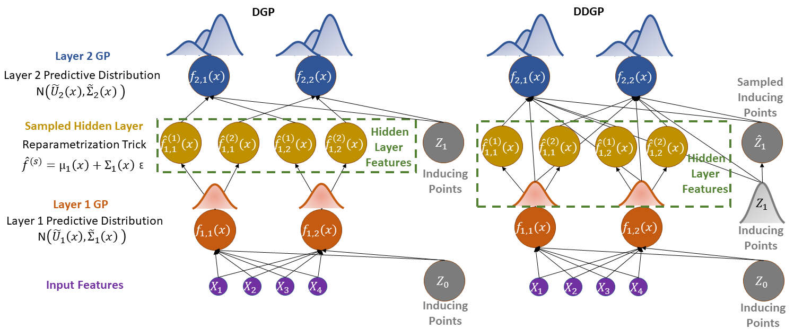
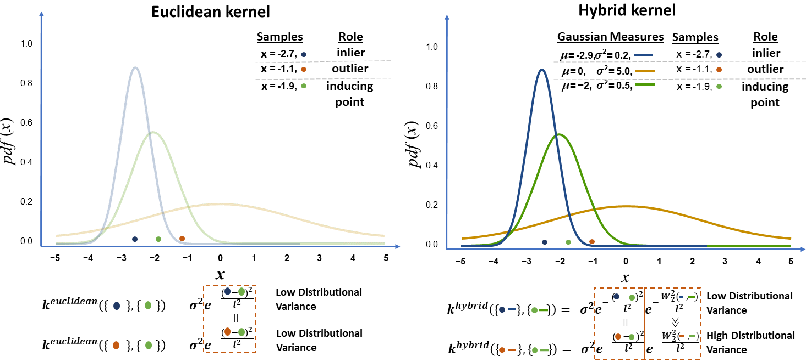

# Under construction


>📋  Accompanying code for "A U-Net model for Local Brain Age"

# A U-Net model for Local Brain Age

This repository is the official implementation of [Hierarchical Gaussian Processes with Wasserstein-2 kernels](https://arxiv.org/abs/2010.14877). 

>📋  

>📋  

## Requirements

To install requirements:

```setup
pip install tensorflow-gpu
```
## Toy examples

To obtain similar plots to Figures 7 and 8 in the paper:

```
python3 dgp_correlation_banana.py.py --num_inducing=16
python3 ddgp_correlation_banana.py.py --num_inducing=16
```

## Citing this work

>📋 If you use this probabilistic framework in your publications, please consider citing the accompanying paper with a BibTeX entry similar to the following:

```
@article{popescu2020hierarchical,
  title={Hierarchical gaussian processes with wasserstein-2 kernels},
  author={Popescu, Sebastian and Sharp, David and Cole, James and Glocker, Ben},
  journal={arXiv preprint arXiv:2010.14877},
  year={2020}
}

```


